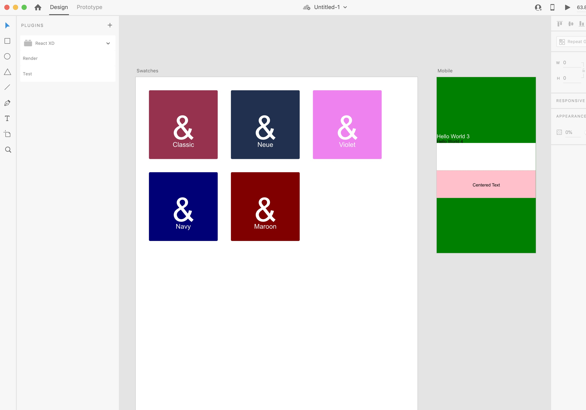

# React XD

Render React components to Adobe XD. This can be used for React cross-platform UI libraries and for creating design systems.

> Inspired by [react-sketchapp](https://github.com/airbnb/react-sketchapp)

## Getting Started

This is a **proof of concept**, so **PLEASE** do not use in **production**. This is published to gauge interest in the project and hopefully get some contribution and feedback.

## Contributing

Please post an issue offering any feedback or help! Thanks!
